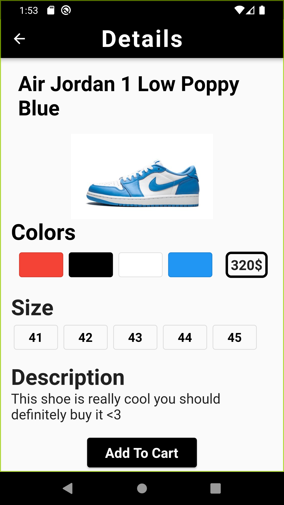
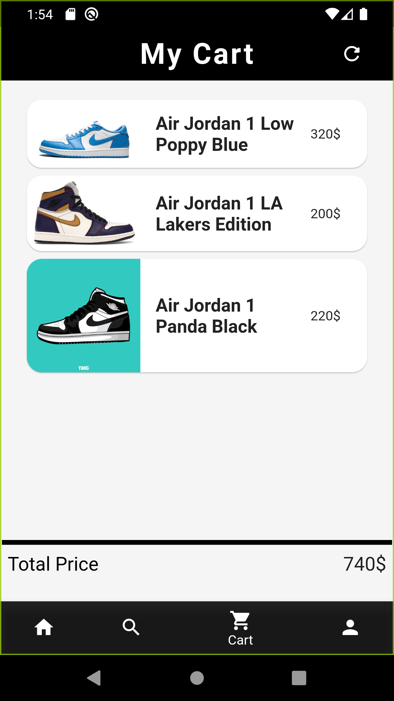

# Shoes Store UI Kit

My first mobile app using flutter, this is a UI kit for a shoes store specialised in selling Nike's shoes.

## Screenshots:
  
  
 
 

## Features:

* You can search for items by name.
* The cart adds up the prices for the items added to it.

## Tools used:
* Android Studio (IDE)
* Dart (logic)
* Flutter (Mobile UI developement kit).
* Illustrator (Image editting)

## Documentation

Flutter is Google's SDK for crafting beautiful, fast user experiences for
mobile, web and desktop from a single codebase. Flutter works with existing
code, is used by developers and organizations around the world, and is free
and open source.

* [Install Flutter](https://flutter.dev/get-started/)
* [Flutter documentation](https://flutter.dev/docs)

For announcements about new releases and breaking changes, follow the
[flutter-announce@googlegroups.com](https://groups.google.com/forum/#!forum/flutter-announce)
mailing list.

## Contribution:
Feel free to `fork` this project and add whatever you like. If you have any suggestions or any comments please feel free to contact me or to open an issue, use free license art assets please.

## Team:
[Jetlighters](https://github.com/JetLightStudio) having fun.
